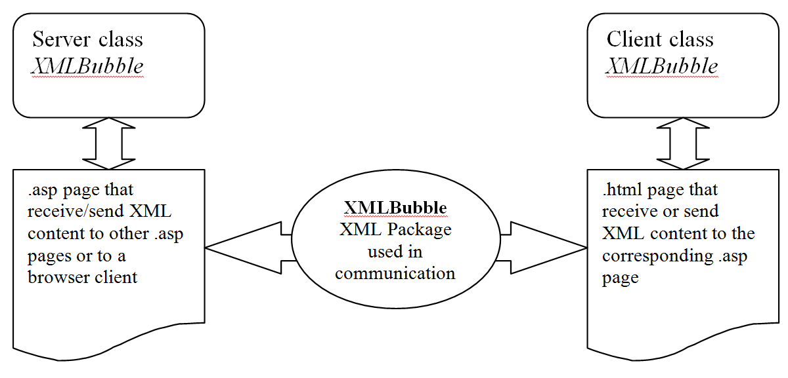
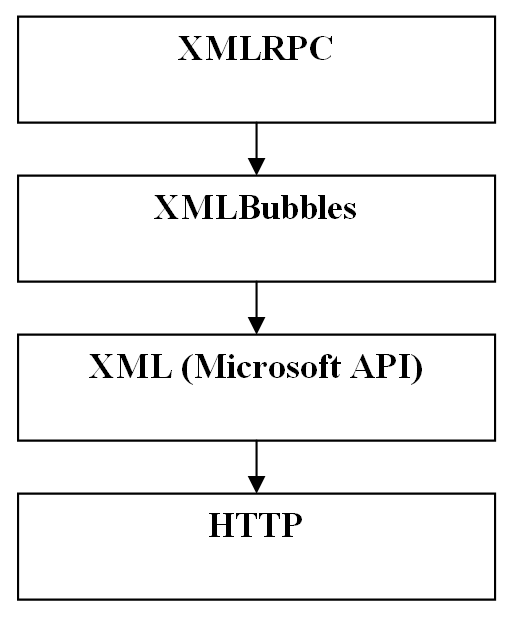

XMLBubbles
==========

Last update: 2001

XMLBubbles (!Bubbles are not SOAP!) it is a complete scripting package (client/server components) designed for ASP web application authors. This package allows sending and retrieving information between a browser and a web server without using HTML standard forms. Basically XMLBubbles is a light web service like implementation created for ASP applications.

The information is packed in a XML envelope that can hold any kind of data - scalars, arrays and binary information – in a transparent way. The user must know nothing about the internal format of this XML because the pack and unpack of the information is done automatically by the scripts of the component. 

The two classes that handle this communication are implemented in 2 files: one .asp file for the server side and one .vbs file for the client side.



The methods and properties exposed by the server and client classes are very almost identical and their short description is given in the following table:

| Class members   | Description |
|-----------------|-------------|
| Function AddData(strFieldID, FieldContent) | Add typed data in the XMLBubble package |
| Property XML | Get/Set the XML from the package |
| Sub LoadFromClient | Load the XML package from the browser |
| Sub LoadFromURL | Load the XML package from a specified URL |
| Sub LoadFromForm | Build the XML package using informations from a specified form |
| Sub SendTo(strURL) | Send the XML package at a specified URL |
| Sub SendToClient | Send the XML package to client |
| Property Get Field | Obtain a field value from the package based on it’s ID |
| FieldCount(strFieldID) | Obtain the number of fields with the same ID |
| Sub FieldNext(strFieldID); Sub FieldPrev(strFieldID); Sub FieldFirst(strFieldID); Sub FieldLast(strFieldID) | Allows the navigation between the fields with the same ID. XML bubbles doesn’t restrict authors to use unique ID’s for fields. |

Each class (client and server) implements the methods for packing and unpacking of almost all data types used in web programming: numbers, strings, date/time, arrays, jagged arrays (recursive arrays with any number of levels), binary information (a file or a blob content).

The functionality of these classes is demonstrated by the examples included in the demo/ folder.
It is adviced to read also the documentation in the doc/ folder.


XMLRPC
------

XMLRPC is built on top of XMLBubbles and allow direct call of server side functions from client-side using Remote Procedure Call pattern.



To use XMLRPC you need to do the following:

On the server side:

- create an .asp page and include bubbles.asp
- put a call to XMLRPCServer
- create custom functions that you want to publish for client consumption

Example:

```
<%@ Language=VBScript %>
<!-- #include file="bubbles.asp" -->
<%
Call XMLRPCServer

Function SayHi(strName)
	SayHi = "Hello " & strName & " !"
End Function

Function Sum(a,b)
	Sum = a + b
End Function
%>
```

On the client side:

- include script bubbles.vbs
- use XMLRPC function to call the desired server-side function

Example:

```
<script language="VBScript" src="bubbles.vbs"></script>
<script language=vbscript>
Sub But1_onclick
	msgbox XMLRPC("./TestXMLBubble4.asp", "Sum", Array(2,3))
End Sub
</script>
```

For more examples please consult the documentation.


